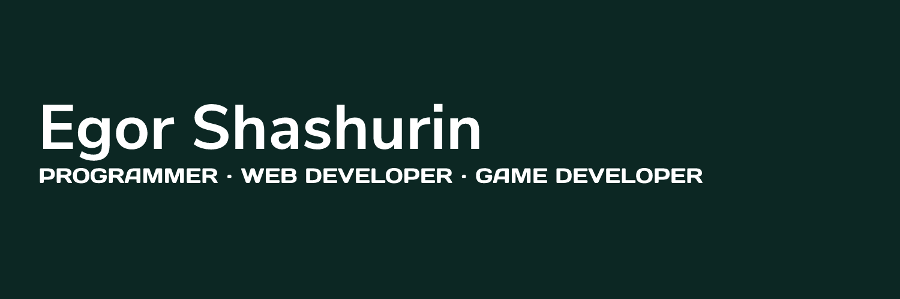

#  Hi there! I`m Egor

___

### :fire: My Stats :

---

### :hammer_and_wrench: Languages and Tools :

  &nbsp;
  &nbsp;
    &nbsp;
    &nbsp;
  &nbsp;
  &nbsp;
  
  
  
  
  

---

## 🤝🏻  Connect with Me

   
